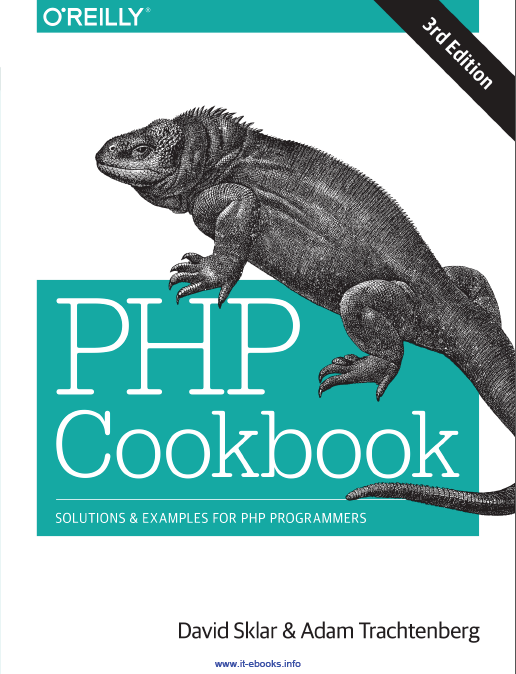

## PHP CookBook(第三版) 

在阅读《 PHP CookBook 》

但是没有找到最新版的中文翻译，特此开一个项目，希望边读边翻译。

----------

## 目录 ##

### Chapter 1: 字符串

1.0 [简介](content/chapter1_strings_1.0_简介.md)

1.1 [访问子字符串](content/chapter1_strings_1.1_访问子字符串.md)

1.2 [提取子字符串](content/chapter1_strings_1.2_提取子字符串.md)

1.3 [替换字符串 ](content/chapter1_strings_1.3_替换字符串.md)

---
<未完待续>

